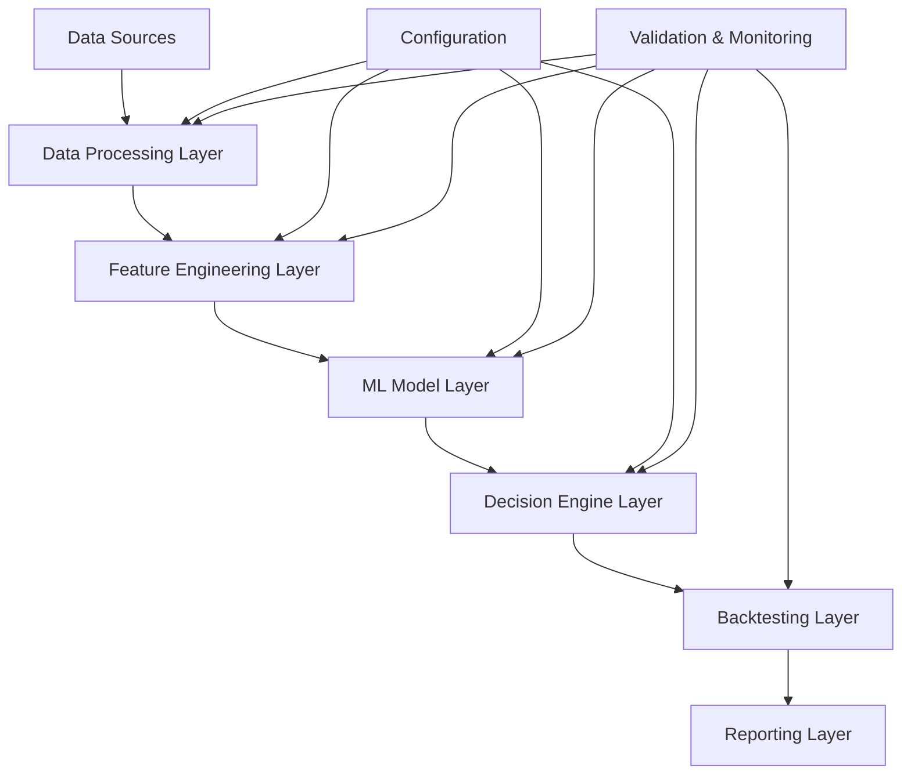
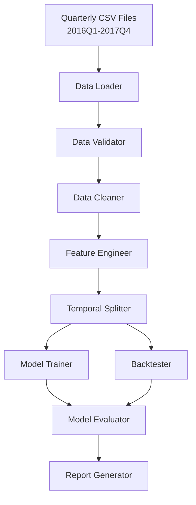
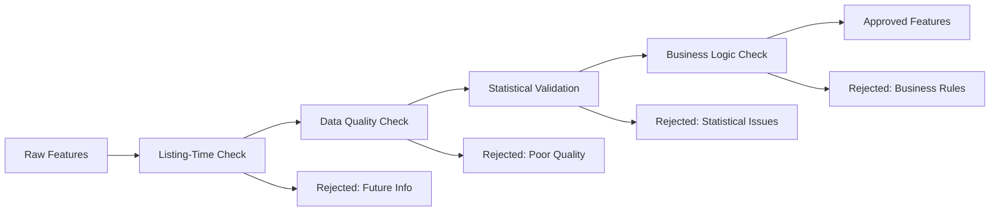
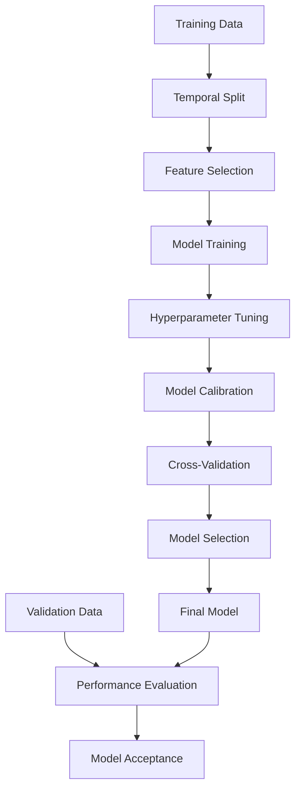
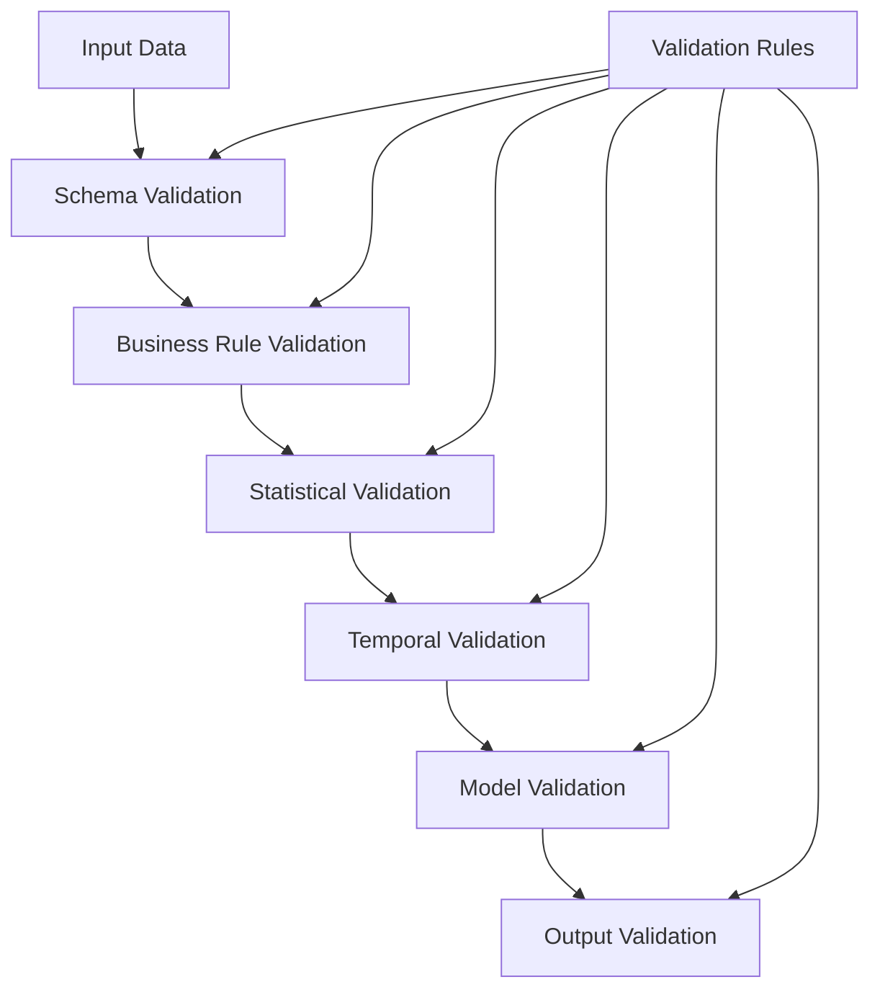
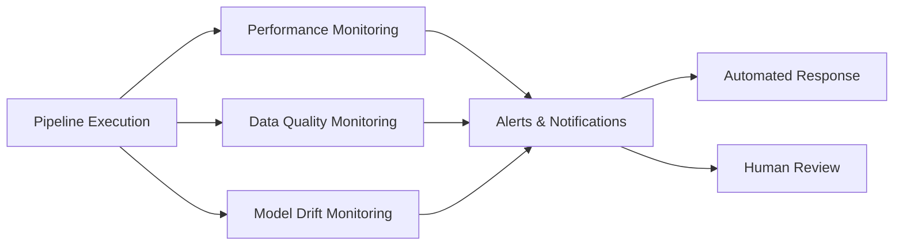
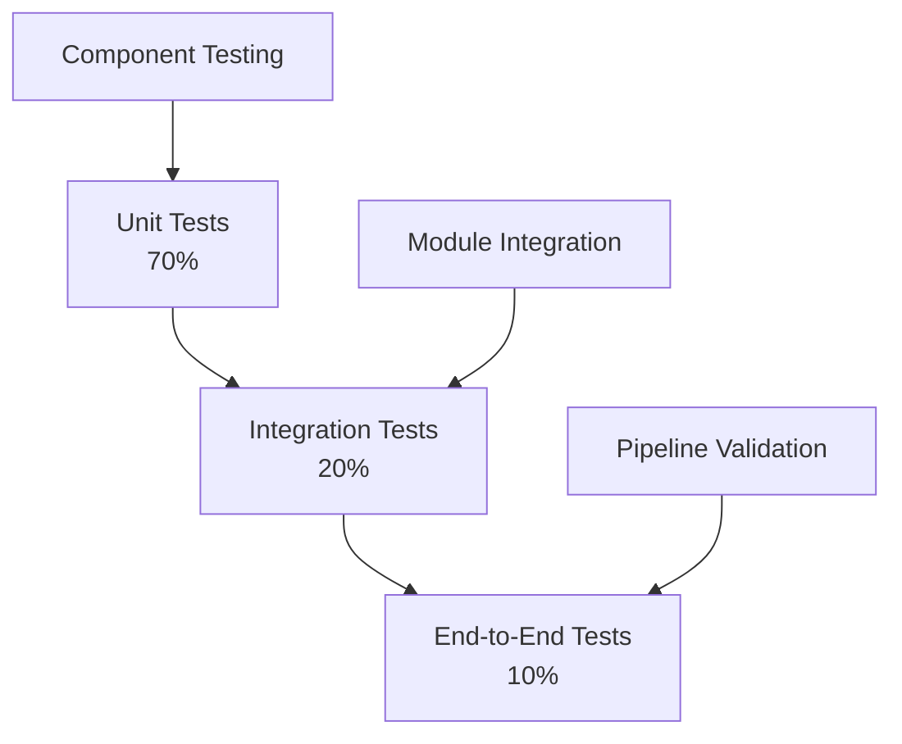

# Architecture Overview — Lending Club ML Pipeline

## Executive Summary

This document provides a comprehensive architectural overview of the Lending Club loan default prediction pipeline. The system implements a production-ready machine learning pipeline that predicts loan default risk and optimizes investment decisions under budget constraints.

## 1. System Architecture

### 1.1 High-Level Architecture



### 1.2 Component Overview

| Component | Purpose | Key Technologies |
|-----------|---------|------------------|
| **Data Processing** | Load, clean, and validate quarterly loan data | pandas, numpy |
| **Feature Engineering** | Create listing-time safe features | scikit-learn, custom transformers |
| **ML Model** | Train calibrated default risk models | scikit-learn, xgboost |
| **Decision Engine** | Apply investment logic with budget constraints | Custom algorithms |
| **Backtesting** | Validate investment performance | Custom metrics |
| **Reporting** | Generate insights and visualizations | matplotlib, seaborn |

## 2. Data Architecture

### 2.1 Data Flow



### 2.2 Data Constraints and Governance

#### Temporal Constraints
- **Training Data**: Earlier quarters only (e.g., 2016Q1-Q3)
- **Validation Data**: Next chronological quarter (e.g., 2016Q4)
- **Backtest Data**: Future quarter for final evaluation (e.g., 2017Q1)

#### Listing-Time Rule Enforcement
```python
# Critical data constraint validation
PROHIBITED_PATTERNS = [
    r'.*pymnt.*',        # Payment-related fields
    r'.*rec_.*',         # Received amounts
    r'chargeoff.*',      # Charge-off information
    r'settlement.*',     # Settlement data
    r'collection.*',     # Collection information
    r'recovery.*'        # Recovery amounts
]

PROHIBITED_FIELDS = [
    'loan_status',       # Final outcome
    'last_pymnt_d',      # Last payment date
    'next_pymnt_d',      # Next payment date
    'out_prncp',         # Outstanding principal
    'total_rec_prncp'    # Total received principal
]
```

## 3. Feature Engineering Architecture

### 3.1 Feature Categories

```python
FEATURE_ARCHITECTURE = {
    'loan_characteristics': {
        'features': ['loan_amnt', 'int_rate', 'installment', 'term', 'grade', 'sub_grade'],
        'transformations': ['normalization', 'encoding'],
        'validation': 'listing_time_safe'
    },
    'borrower_attributes': {
        'features': ['annual_inc', 'emp_length', 'home_ownership', 'verification_status', 'dti'],
        'transformations': ['imputation', 'encoding', 'scaling'],
        'validation': 'listing_time_safe'
    },
    'credit_history': {
        'features': ['fico_range_low', 'delinq_2yrs', 'inq_last_6mths', 'open_acc'],
        'transformations': ['binning', 'normalization'],
        'validation': 'listing_time_safe'
    },
    'derived_features': {
        'features': ['debt_to_income_ratio', 'credit_utilization', 'employment_stability'],
        'transformations': ['custom_calculations'],
        'validation': 'listing_time_safe'
    }
}
```

### 3.2 Feature Validation Pipeline



## 4. Machine Learning Architecture

### 4.1 Model Training Pipeline



### 4.2 Model Architecture Options

| Model Type | Use Case | Pros | Cons |
|------------|----------|------|------|
| **Logistic Regression** | Baseline, interpretability | Fast, interpretable, well-calibrated | Limited complexity |
| **Random Forest** | Robust performance | Handles non-linearity, feature importance | Black box, overfitting risk |
| **Gradient Boosting** | High performance | Excellent predictive power | Complex, requires tuning |

### 4.3 Calibration Strategy

```python
CALIBRATION_PIPELINE = {
    'method': 'platt_scaling',  # or 'isotonic'
    'cross_validation': {
        'method': 'temporal_cv',
        'n_splits': 3
    },
    'evaluation_metrics': [
        'brier_score',
        'expected_calibration_error',
        'reliability_curve'
    ]
}
```

## 5. Decision Making Architecture

### 5.1 Investment Decision Flow

```mermaid
flowchart TD
    A[Model Predictions<br/>P(default)] --> B[Expected Value<br/>Calculation]
    B --> C[Risk Assessment<br/>& Ranking]
    C --> D[Budget Constraint<br/>Application]
    D --> E[Final Selection]
    E --> F[Selection Report]
    
    G[Loan Characteristics] --> B
    H[Investment Strategy] --> C
    I[Budget Parameters] --> D
```

### 5.2 Selection Strategies

```python
SELECTION_STRATEGIES = {
    'lowest_risk': {
        'criterion': 'min(predicted_probability)',
        'ranking': 'ascending',
        'budget_allocation': 'greedy'
    },
    'highest_expected_value': {
        'criterion': 'max(expected_return - risk_adjusted_cost)',
        'ranking': 'descending', 
        'budget_allocation': 'optimal'
    },
    'balanced_portfolio': {
        'criterion': 'sharpe_ratio_maximization',
        'ranking': 'risk_return_tradeoff',
        'budget_allocation': 'portfolio_optimization'
    }
}
```

## 6. Backtesting Architecture

### 6.1 Backtesting Framework

```python
class BacktestArchitecture:
    """
    Comprehensive backtesting framework for investment decisions.
    """
    
    def __init__(self):
        self.metrics = [
            'default_rate_comparison',
            'roi_proxy_calculation', 
            'risk_adjusted_returns',
            'portfolio_concentration',
            'performance_attribution'
        ]
        
    def calculate_roi_proxy(self):
        """
        ROI Proxy Formula:
        - No Default: collected = installment × term_months
        - Default: collected = 0.30 × installment × term_months  
        - ROI = (collected - principal) / principal
        """
        pass
```

### 6.2 Performance Metrics

| Metric | Formula | Business Interpretation |
|--------|---------|------------------------|
| **Default Rate** | defaults / total_loans | Risk management effectiveness |
| **ROI Proxy** | (collected - principal) / principal | Investment return |
| **Sharpe Ratio** | (return - risk_free) / volatility | Risk-adjusted performance |
| **Maximum Drawdown** | max(peak - trough) / peak | Worst-case scenario impact |

## 7. Validation and Quality Architecture

### 7.1 Multi-Layer Validation



### 7.2 Quality Gates

```python
QUALITY_GATES = {
    'data_quality': {
        'missing_rate_threshold': 0.50,
        'outlier_rate_threshold': 0.05,
        'duplicate_rate_threshold': 0.01
    },
    'model_performance': {
        'min_roc_auc': 0.65,
        'max_brier_score': 0.20,
        'min_calibration_pvalue': 0.05
    },
    'business_metrics': {
        'min_roi_improvement': 0.02,
        'max_portfolio_risk': 0.15,
        'min_loan_diversity': 100
    }
}
```

## 8. Deployment Architecture

### 8.1 Execution Environment

```python
DEPLOYMENT_SPECS = {
    'runtime': {
        'python_version': '3.9+',
        'memory_requirement': '8GB_minimum',
        'cpu_cores': '4+',
        'execution_time': '<60_minutes'
    },
    'dependencies': {
        'core_packages': ['pandas', 'numpy', 'scikit-learn'],
        'optional_packages': ['xgboost', 'lightgbm'],
        'version_pinning': 'required'
    },
    'outputs': {
        'models': 'pickled_estimators',
        'reports': 'markdown_and_html',
        'visualizations': 'png_svg_formats',
        'data': 'csv_parquet_formats'
    }
}
```

### 8.2 Operational Monitoring



## 9. Security and Compliance Architecture

### 9.1 Data Security

```python
SECURITY_REQUIREMENTS = {
    'data_protection': {
        'encryption_at_rest': False,  # Local development
        'encryption_in_transit': False,  # Local development  
        'access_control': 'file_system_permissions',
        'audit_logging': True
    },
    'privacy': {
        'pii_handling': 'no_pii_storage',
        'data_retention': 'project_duration_only',
        'anonymization': 'not_required'
    },
    'compliance': {
        'regulatory_framework': 'none_specified',
        'data_governance': 'internal_policies',
        'model_explainability': 'required'
    }
}
```

## 10. Performance and Scalability

### 10.1 Performance Benchmarks

| Component | Target Performance | Actual Measurement |
|-----------|-------------------|-------------------|
| **Data Loading** | < 30s per quarter | Monitor |
| **Feature Engineering** | < 5 min total | Monitor |
| **Model Training** | < 30 min with tuning | Monitor |
| **Backtesting** | < 10s for 50K loans | Monitor |
| **End-to-End** | < 60 min total | Monitor |

### 10.2 Scalability Considerations

```python
SCALABILITY_DESIGN = {
    'data_volume': {
        'current': '2GB_quarterly_files',
        'maximum': '10GB_quarterly_files',
        'strategy': 'chunked_processing'
    },
    'model_complexity': {
        'current': '50_features_max',
        'maximum': '500_features_max', 
        'strategy': 'feature_selection'
    },
    'compute_resources': {
        'current': 'single_machine',
        'scaling_option': 'cloud_compute',
        'parallelization': 'embarrassingly_parallel'
    }
}
```

## 11. Testing Strategy

### 11.1 Testing Pyramid



### 11.2 Testing Coverage

```python
TESTING_REQUIREMENTS = {
    'unit_tests': {
        'coverage_target': 0.80,
        'focus_areas': ['data_processing', 'feature_engineering', 'model_training']
    },
    'integration_tests': {
        'coverage_target': 0.60,
        'focus_areas': ['pipeline_flow', 'data_consistency', 'temporal_validation']
    },
    'validation_tests': {
        'coverage_target': 1.00,
        'focus_areas': ['listing_time_compliance', 'performance_thresholds']
    }
}
```

## 12. Documentation Architecture

### 12.1 Documentation Structure

```
docs/
├── REQUIREMENTS.md              # Business requirements
├── TECHNICAL_REQUIREMENTS.md    # Technical specifications  
├── API_SPECIFICATION.md         # Interface definitions
├── ARCHITECTURE_OVERVIEW.md     # This document
├── data_dictionary.xlsx         # Data schema
├── AI_USAGE_TEMPLATE.md        # AI assistance tracking
└── SUMMARY.md                  # Executive summary
```

### 12.2 Documentation Standards

```python
DOCUMENTATION_STANDARDS = {
    'code_documentation': {
        'docstring_format': 'numpy_style',
        'type_hints': 'required',
        'complexity_comments': 'required_for_complex_logic'
    },
    'technical_documentation': {
        'format': 'markdown',
        'diagrams': 'mermaid_preferred',
        'update_frequency': 'with_each_change'
    },
    'user_documentation': {
        'setup_guide': 'step_by_step',
        'troubleshooting': 'common_issues',
        'examples': 'working_code_samples'
    }
}
```

## 13. Future Architecture Considerations

### 13.1 Scalability Enhancements

```python
FUTURE_ENHANCEMENTS = {
    'distributed_processing': {
        'framework': 'dask_or_spark',
        'trigger': 'data_volume_>_10GB'
    },
    'model_serving': {
        'deployment': 'rest_api_or_batch',
        'trigger': 'production_deployment'
    },
    'real_time_processing': {
        'streaming': 'kafka_or_kinesis',
        'trigger': 'real_time_decisions'
    },
    'advanced_ml': {
        'deep_learning': 'pytorch_or_tensorflow',
        'trigger': 'performance_plateau'
    }
}
```

### 13.2 Technology Evolution

| Current Technology | Future Alternative | Migration Trigger |
|-------------------|-------------------|------------------|
| **pandas** | Polars/DuckDB | Memory constraints |
| **scikit-learn** | XGBoost/LightGBM | Performance requirements |
| **Jupyter** | Production pipelines | Operational deployment |
| **Local storage** | Cloud storage | Data volume growth |

---

## Summary

This architecture provides a comprehensive, scalable, and maintainable foundation for the Lending Club ML pipeline. The modular design ensures that individual components can be developed, tested, and deployed independently while maintaining system integrity and performance requirements.

The architecture emphasizes:
- **Reproducibility** through comprehensive configuration management
- **Maintainability** through clear API specifications and modular design
- **Scalability** through performance benchmarks and future enhancement planning
- **Quality** through multi-layer validation and comprehensive testing
- **Compliance** through listing-time rule enforcement and audit capabilities

*This architecture serves as the technical blueprint for implementing a production-ready machine learning pipeline for loan default prediction and investment optimization.*
